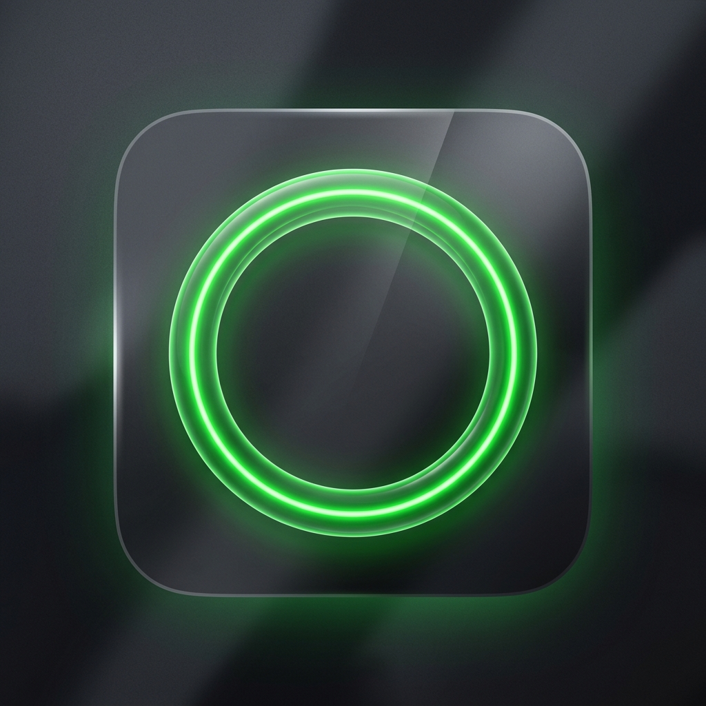

<p align="center">
  
</p>

<h1 align="center">LightConda</h1>

<p align="center">
  A blazing-fast, fully native macOS app for managing Conda environments — built entirely in Swift.
</p>

<p align="center">
  
  
  
  
  
</p>

---

Most Conda GUIs are slow Electron wrappers with bloated runtimes and clunky interfaces. **LightConda** is different — it's a compiled, native Apple application that launches in under a tenth of a second, uses around 20MB of memory, and feels exactly like a macOS app should.

No JavaScript runtime. No Python subprocess. No 200MB bundle. Just Swift.

---

## Features

**Environment Management**
Automatically discovers Conda installations across standard paths (`miniconda3`, `anaconda3`, `homebrew/cask`, etc.) and renders them in a clean card grid. Each card shows the environment's path, active status, Python version, and disk footprint — calculated lazily in the background so the UI stays snappy.

**Package Inspector**
A multi-column SwiftUI `Table` listing every package in a selected environment. Sortable by name, version, build string, or channel. Includes a live search bar that filters results as you type.

**Environment Creation Wizard**
A guided panel for building new environments. Pick a name, choose a Python version, specify dependencies — then watch Conda's real-time stdout stream into a dark terminal-style scroll view as the environment is created in the background.

**Safe Deletion**
Confirmation-gated deletion that removes environments by physical path, executed off the main thread to keep the UI responsive throughout.

**One-Click Terminal Activation**
An AppleScript-powered launcher that opens a fresh native Terminal window and immediately runs `conda activate` for your selected environment — no manual copying of paths or commands.

**Diagnostics & Calibration**
A settings pane exposing architecture info, Conda binary status, and package cache size. Supports setting a custom Conda binary path via a standard macOS file picker.

---

## Requirements

| Requirement | Detail |
|---|---|
| macOS | 14.0 Sonoma or later |
| Architecture | Apple Silicon (M1–M4) or Intel |
| Xcode CLI Tools | Required for compilation |
| Conda | Miniconda or Anaconda installed locally |

---

## Installation

### Step 1 — Install Conda (if needed)

If you don't have Conda installed, grab Miniconda:

```bash
# Download the Apple Silicon installer
curl -O https://repo.anaconda.com/miniconda/Miniconda3-latest-MacOSX-arm64.sh

# Run it
bash ./Miniconda3-latest-MacOSX-arm64.sh
```

**Recommended post-install hardening:**

```bash
# Don't activate base on every new shell
conda config --set auto_activate_base false

# Find your base path
conda info --base

# Lock the base environment against accidental writes
# (replace the path with the output of the command above)
chmod -R a-w /path/to/miniconda3/conda-meta
```

> [!TIP]
> **Need to update Conda later?** Temporarily unlock, update, then re-lock:
> ```bash
> chmod -R u+w /path/to/miniconda3/conda-meta
> conda update -n base conda
> chmod -R a-w /path/to/miniconda3/conda-meta
> ```

---

### Step 2 — Build LightConda

```bash
# Clone the repo
git clone https://github.com/your-username/lightconda.git
cd lightconda

# Build and package
./build.sh
```

Once done, double-click `LightConda.app` to launch it immediately — or drag it into your **Applications** folder to access it from Spotlight and Launchpad like any other app.

**No full Xcode install required** — only the free Xcode Command Line Tools (`xcode-select --install`).

---

## Why No Pre-Built Download?

A pre-compiled `.app` downloaded from the internet carries a macOS quarantine attribute. Without a paid Apple Developer certificate, Gatekeeper will block it from running.

Building locally sidesteps this entirely — the executable is generated directly on your machine, so macOS trusts it and launches it without any security overrides. The build takes under 30 seconds.

---

## Project Structure

```
lightconda/
├── build.sh                    # Compile, bundle, and zip in one command
├── process_icon.py             # Slice the 1024×1024 PNG into iconset dimensions
├── AppIcon.png                 # Glassmorphism app icon (1024×1024)
└── Sources/
    ├── App.swift               # @main entry point
    ├── AppView.swift           # Navigation split view & sidebar layout
    ├── CondaManager.swift      # Subprocess runner & output parser
    ├── CreateEnvSheet.swift    # Live-streaming environment creation panel
    ├── EnvironmentsListView.swift  # Interactive environment card grid
    ├── Models.swift            # Decodable structs for Conda JSON output
    ├── PackageDetailsSheet.swift   # Sortable package table with search
    └── SettingsView.swift      # Diagnostics, custom paths, file picker
```

---

## Technical Notes

- **Swift 6 + SwiftUI** — strict concurrency, zero Objective-C bridging overhead
- **AppKit integration** for AppleScript-powered Terminal activation
- **Background threading** for all subprocess calls — the UI never blocks
- **Lazy disk calculation** — environment footprints are computed on demand, not at scan time
- **Single binary, no frameworks** — compiles down to under 2MB zipped

---

## License

Apache-2.0 license — see [`LICENSE`](LICENSE) for details.